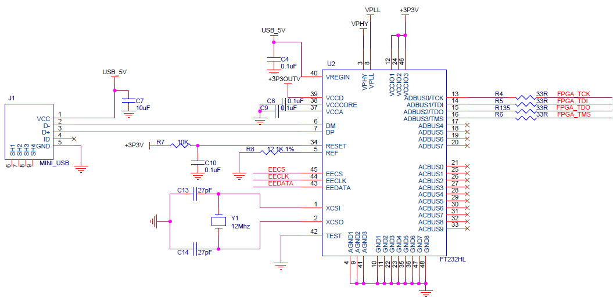
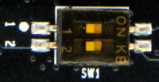

 芯驿电子科技（上海）有限公司 基于XILINX
ZYNQ7000开发平台的开发板（型号：AX7021B）2022款正式发布了正式发布了，为了让您对此开发平台可以快速了解，我们编写了此用户手册。

这款ZYNQ7000
FPGA开发平台采用核心板加扩展板的模式，方便用户对核心板的二次开发利用。核心板使用XILINX的Zynq7000
SOC 芯片的解决方案，它采用ARM+FPGA SOC技术将双核ARM Cortex-A9 和FPGA
可编程逻辑集成在一颗芯片上。另外核心板上含有2片共1GB高速DDR3
SDRAM芯片，1片8GB的eMMC存储芯片和1片256Mb的QSPI FLASH芯片。

在底板设计上我们为用户扩展了丰富的外围接口，比如5路千兆以太网接口，4路USB2.0
HOST接口，1路HDMI输出接口，Uart通信接口，SD卡座，40针扩展接口等等。满足用户各种以太网高速数据交换，数据存储，视频传输处理以及工业控制的要求，是一款"专业级“的ZYNQ开发平台。为高速以太网数据传输和交换，数据处理的前期验证和后期应用提供了可能。相信这样的一款产品非常适合从事ZYNQ开发的学生、工程师等群体。

      
开发板简介
==========

在这里，对这款AX7021B ZYNQ开发平台进行简单的功能介绍。

开发板的整个结构，继承了我们一贯的核心板+扩展板的模式来设计的。核心板和扩展板之间使用高速板间连接器连接。

核心板主要由ZYNQ7020 + 2个DDR3 + eMMC + QSPI
FLASH的最小系统构成，承担ZYNQ系统的高速数据处理和存储的功能，
ZYNQ7020和两片DDR3之间的数据位宽为32位，两片DDR3容量高达1GB。8GB的eMMC
FLASH存储芯片和256Mb的QSPI
FLASH用来静态存储ZYNQ的操作系统、文件系统及用户数据，用户可以通过核心板上的拨码开关来选择不同的启动方式。ZYNQ7020
采用Xilinx公司的Zynq7000系列的芯片，型号为XC7Z020-2CLG484I。ZYNQ7020芯片可分成处理器系统部分Processor
System（PS）和可编程逻辑部分Programmable Logic（PL）。

底板为核心板扩展了丰富的外围接口，其中包含5路千兆以太网接口、4路USB2.0
HOST接口、1路HDMI输出接口、1路SD Card接口、1路UART
USB接口、1路SD卡接口、2路40针的扩展口和一些按键LED。

下图为整个开发系统的结构示意图：

通过这个示意图，我们可以看到，我们这个开发平台所能含有的接口和功能。

-   ZYNQ7000核心板

由XC7Z020+1GB DDR3+8GB eMMC FLASH + 256Mb QSPI
FLASH组成，另外有两个晶振提供时钟，一个是33.3333MHz提供给PS系统，另一个是50MHz提供给PL逻辑。

-  千兆以太网接口

5路10/100M/1000M以太网RJ45接口，用于和电脑或其它网络设备进行以太网数据交换。网络接口芯片采用景略公司的JL2121工业级GPHY芯片，1路以太网连接到ZYNQ芯片的PS端，4路以太网连接到ZYNQ芯片的PL端。

-  HDMI显示输出

1路HDMI输出接口，我们选用了Silion Image公司的SIL9134
HDMI编码芯片，最高支持1080P@60Hz输出，支持3D输出。

-  USB Uart接口

2路Uart转USB接口，用于和电脑通信，方便用户调试。1路在核心板上，核心板独立工作是使用，
1路在底板上， 整板调试时使用。串口芯片采用Silicon Labs
CP2102GM的USB-UAR芯片, USB接口采用MINI USB接口。

-  Micro SD卡座

1路Micro SD卡座，用于存储操作系统镜像和文件系统。

-  40针扩展口

2个40针2.54mm间距的扩展口，可以外接黑金的各种模块（双目摄像头，TFT
LCD屏，高速AD模块等等）。扩展口包含5V电源1路，3.3V电源2路，地3路，IO口34路。

-  USB JTAG口

1个JTAG调试接口，采用MINI
USB接口，用户可以通过USB线及板载的JTAG电路对ZYNQ系统进行调试和下载。

-  LED灯

9个发光二极管LED,
核心板上6个，底板上3个。核心板上1个电源指示灯；1个DONE配置指示灯；2个用户指示灯和2个串口收发指示灯。底板上有1个电源指示灯和2个用户指示灯。

-  按键

3个按键，1个复位按键在核心板上，2个用户按键在底板上。

AC7021B核心板
=============

 

简介
----

AC7021B(**核心板型号，下同**)核心板，ZYNQ芯片是基于XILINX公司的ZYNQ7000系列的XC7Z020-2CLG484I。ZYNQ芯片的PS系统集成了两个ARM
Cortex™-A9处理器，AMBA®互连，内部存储器，外部存储器接口和外设。ZYNQ芯片的FPGA内部含有丰富的可编程逻辑单元，DSP和内部RAM。

这款核心板使用了2片SKHynix公司的H5TQ4G63AFR-PBI这款DDR3芯片，每片DDR的容量为4Gbit；2片DDR芯片组合成32bit的数据总线宽度，ZYNQ和DDR3之间的读写数据时钟频率高达533Mhz；这样的配置，可以满足系统的高带宽的数据处理的需求。
为了和底板连接，这款核心板的4个板对板连接器扩展出了PS端的USB接口，千兆以太网接口，SD卡接口及其它剩余的MIO口。以及PL端的BANK13,BANK33,BAN34和BANK35的几乎所有IO口（198个），其中BANK33和BANK34的IO的电平可以通过更换核心板上的LDO芯片来修改，满足用户不用电平接口的要求。对于需要大量IO的用户，此核心板将是不错的选择。而且IO连接部分，ZYNQ芯片到接口之间走线做了等长和差分处理，并且核心板尺寸仅为60*60（mm），对于二次开发来说，非常适合。

      
AC7021B核心板正面图

            
AC7021B核心板背面图

ZYNQ芯片
--------

开发板使用的是Xilinx公司的Zynq7000系列的芯片，型号为XC7Z020-2CLG484I。芯片的PS系统集成了两个ARM
Cortex™-A9处理器，AMBA®互连，内部存储器，外部存储器接口和外设。这些外设主要包括USB总线接口，以太网接口，SD/SDIO接口，I2C总线接口，CAN总线接口，UART接口，GPIO等。PS可以独立运行并在上电或复位下启动。ZYNQ7000芯片的总体框图如图2-2-1所示

.. image:: images/media/image6.png
      
图2-2-1 ZYNQ7000芯片的总体框图

其中PS系统部分的主要参数如下：

-  基于ARM 双核CortexA9 的应用处理器，ARM-v7架构 高达1GHz

-  每个CPU 32KB 1级指令和数据缓存，512KB 2级缓存 2个CPU共享

-  片上boot ROM和256KB 片内RAM

-  外部存储接口，支持16/32 bit DDR2、DDR3接口

-  两个千兆网卡支持：发散-聚集DMA ，GMII，RGMII，SGMII接口

-  两个USB2.0 OTG接口，每个最多支持12节点

-  两个CAN2.0B总线接口

-  两个SD卡、SDIO、MMC兼容控制器

-  2个SPI，2个UARTs，2个I2C接口

-  4组32bit GPIO，54（32+22）作为PS系统IO，64连接到PL

-  PS内和PS到PL的高带宽连接

其中PL逻辑部分的主要参数如下：

-  逻辑单元Logic Cells：85K；

-  查找表LUTs: 53,200

-  触发器(flip-flops):106,400

-  乘法器18x25MACCs：220;

-  Block RAM：4.9Mb；

-  两个AD转换器,可以测量片上电压、温度感应和高达17外部差分输入通道，1MBPS

XC7Z020-2CLG484I芯片的速度等级为-2，工业级，封装为BGA484，引脚间距为0.8mm，ZYNQ7000系列的具体的芯片型号定义如下图2-2-2所示。

.. image:: images/media/image7.png
      
图2-2-2 ZYNQ型号命名规则定义

DDR3 DRAM
---------

AC7021B核心板上配有两片美光公司的DDR3
SDRAM芯片(共计1GB),型号为MT41K256M16TW-107(兼容H5TQ4G63AFR-PBI）。DDR3
SDRAM的总线宽度共为32bit。DDR3
SDRAM的最高运行速度可达533MHz(数据速率1066Mbps)。该DDR3存储系统直接连接到了ZYNQ处理系统（PS）的BANK
502的存储器接口上。DDR3 SDRAM的具体配置如下表2-3-1所示。

表5-1 DDR3 SDRAM配置

+-------------+----------------------+-----------------+-------------+
| **位号**    | **芯片型号**         | **容量**        | **厂家**    |
+-------------+----------------------+-----------------+-------------+
| U5,U6       | MT41K256M16TW-107    | 256M x 16bit    | 美光        |
+-------------+----------------------+-----------------+-------------+

DDR3的硬件设计需要严格考虑信号完整性，我们在电路设计和PCB设计的时候已经充分考虑了匹配电阻/终端电阻,走线阻抗控制，走线等长控制，　保证DDR3的高速稳定的工作。

DDR3 DRAM的硬件连接方式如图2-3-1所示:

图2-3-1 DDR3 DRAM原理图部分

**DDR3 DRAM引脚分配：**

+-----------------------+---------------------+------------------------+
| **信号名称**          | **ZYNQ引脚名**      | **ZYNQ引脚号**         |
+-----------------------+---------------------+------------------------+
| **DDR3_DQS0_P**       | PS_DDR_DQS_P0_502   | C2                     |
+-----------------------+---------------------+------------------------+
| **DDR3_DQS0_N**       | PS_DDR_DQS_N0_502   | D2                     |
+-----------------------+---------------------+------------------------+
| **DDR3_DQS1_P**       | PS_DDR_DQS_P1_502   | H2                     |
+-----------------------+---------------------+------------------------+
| **DDR3_DQS1_N**       | PS_DDR_DQS_N1_502   | J2                     |
+-----------------------+---------------------+------------------------+
| **DDR3_DQS2_P**       | PS_DDR_DQS_P2_502   | N2                     |
+-----------------------+---------------------+------------------------+
| **DDR3_DQS2_N**       | PS_DDR_DQS_N2_502   | P2                     |
+-----------------------+---------------------+------------------------+
| **DDR3_DQS3_P**       | PS_DDR_DQS_P3_502   | V2                     |
+-----------------------+---------------------+------------------------+
| **DDR3_DQS4_N**       | PS_DDR_DQS_N3_502   | W2                     |
+-----------------------+---------------------+------------------------+
| **DDR3_D0**           | PS_DDR_DQ0_502      | D1                     |
+-----------------------+---------------------+------------------------+
| **DDR3_D1**           | PS_DDR_DQ1_502      | C3                     |
+-----------------------+---------------------+------------------------+
| **DDR3_D2**           | PS_DDR_DQ2_502      | B2                     |
+-----------------------+---------------------+------------------------+
| **DDR3_D3**           | PS_DDR_DQ3_502      | D3                     |
+-----------------------+---------------------+------------------------+
| **DDR3_D4**           | PS_DDR_DQ4_502      | E3                     |
+-----------------------+---------------------+------------------------+
| **DDR3_D5**           | PS_DDR_DQ5_502      | E1                     |
+-----------------------+---------------------+------------------------+
| **DDR3_D6**           | PS_DDR_DQ6_502      | F2                     |
+-----------------------+---------------------+------------------------+
| **DDR3_D7**           | PS_DDR_DQ7_502      | F1                     |
+-----------------------+---------------------+------------------------+
| **DDR3_D8**           | PS_DDR_DQ8_502      | G2                     |
+-----------------------+---------------------+------------------------+
| **DDR3_D9**           | PS_DDR_DQ9_502      | G1                     |
+-----------------------+---------------------+------------------------+
| **DDR3_D10**          | PS_DDR_DQ10_502     | L1                     |
+-----------------------+---------------------+------------------------+
| **DDR3_D11**          | PS_DDR_DQ11_502     | L2                     |
+-----------------------+---------------------+------------------------+
| **DDR3_D12**          | PS_DDR_DQ12_502     | L3                     |
+-----------------------+---------------------+------------------------+
| **DDR3_D13**          | PS_DDR_DQ13_502     | K1                     |
+-----------------------+---------------------+------------------------+
| **DDR3_D14**          | PS_DDR_DQ14_502     | J1                     |
+-----------------------+---------------------+------------------------+
| **DDR3_D15**          | PS_DDR_DQ15_502     | K3                     |
+-----------------------+---------------------+------------------------+
| **DDR3_D16**          | PS_DDR_DQ16_502     | M1                     |
+-----------------------+---------------------+------------------------+
| **DDR3_D17**          | PS_DDR_DQ17_502     | T3                     |
+-----------------------+---------------------+------------------------+
| **DDR3_D18**          | PS_DDR_DQ18_502     | N3                     |
+-----------------------+---------------------+------------------------+
| **DDR3_D19**          | PS_DDR_DQ19_502     | T1                     |
+-----------------------+---------------------+------------------------+
| **DDR3_D20**          | PS_DDR_DQ20_502     | R3                     |
+-----------------------+---------------------+------------------------+
| **DDR3_D21**          | PS_DDR_DQ21_502     | T2                     |
+-----------------------+---------------------+------------------------+
| **DDR3_D22**          | PS_DDR_DQ22_502     | M2                     |
+-----------------------+---------------------+------------------------+
| **DDR3_D23**          | PS_DDR_DQ23_502     | R1                     |
+-----------------------+---------------------+------------------------+
| **DDR3_D24**          | PS_DDR_DQ24_502     | AA3                    |
+-----------------------+---------------------+------------------------+
| **DDR3_D25**          | PS_DDR_DQ25_502     | U1                     |
+-----------------------+---------------------+------------------------+
| **DDR3_D26**          | PS_DDR_DQ26_502     | AA1                    |
+-----------------------+---------------------+------------------------+
| **DDR3_D27**          | PS_DDR_DQ27_502     | U2                     |
+-----------------------+---------------------+------------------------+
| **DDR3_D28**          | PS_DDR_DQ28_502     | W1                     |
+-----------------------+---------------------+------------------------+
| **DDR3_D29**          | PS_DDR_DQ29_502     | Y3                     |
+-----------------------+---------------------+------------------------+
| **DDR3_D30**          | PS_DDR_DQ30_502     | W3                     |
+-----------------------+---------------------+------------------------+
| **DDR3_D31**          | PS_DDR_DQ31_502     | Y1                     |
+-----------------------+---------------------+------------------------+
| **DDR3_DM0**          | PS_DDR_DM0_502      | B1                     |
+-----------------------+---------------------+------------------------+
| **DDR3_DM1**          | PS_DDR_DM1_502      | H3                     |
+-----------------------+---------------------+------------------------+
| **DDR3_DM2**          | PS_DDR_DM2_502      | P1                     |
+-----------------------+---------------------+------------------------+
| **DDR3_DM3**          | PS_DDR_DM3_502      | AA2                    |
+-----------------------+---------------------+------------------------+
| **DDR3_A0**           | PS_DDR_A0_502       | M4                     |
+-----------------------+---------------------+------------------------+
| **DDR3_A1**           | PS_DDR_A1_502       | M5                     |
+-----------------------+---------------------+------------------------+
| **DDR3_A2**           | PS_DDR_A2_502       | K4                     |
+-----------------------+---------------------+------------------------+
| **DDR3_A3**           | PS_DDR_A3_502       | L4                     |
+-----------------------+---------------------+------------------------+
| **DDR3_A4**           | PS_DDR_A4_502       | K6                     |
+-----------------------+---------------------+------------------------+
| **DDR3_A5**           | PS_DDR_A5_502       | K5                     |
+-----------------------+---------------------+------------------------+
| **DDR3_A6**           | PS_DDR_A6_502       | J7                     |
+-----------------------+---------------------+------------------------+
| **DDR3_A7**           | PS_DDR_A7_502       | J6                     |
+-----------------------+---------------------+------------------------+
| **DDR3_A8**           | PS_DDR_A8_502       | J5                     |
+-----------------------+---------------------+------------------------+
| **DDR3_A9**           | PS_DDR_A9_502       | H5                     |
+-----------------------+---------------------+------------------------+
| **DDR3_A10**          | PS_DDR_A10_502      | J3                     |
+-----------------------+---------------------+------------------------+
| **DDR3_A11**          | PS_DDR_A11_502      | G5                     |
+-----------------------+---------------------+------------------------+
| **DDR3_A12**          | PS_DDR_A12_502      | H4                     |
+-----------------------+---------------------+------------------------+
| **DDR3_A13**          | PS_DDR_A13_502      | F4                     |
+-----------------------+---------------------+------------------------+
| **DDR3_A14**          | PS_DDR_A14_502      | G4                     |
+-----------------------+---------------------+------------------------+
| **DDR3_BA0**          | PS_DDR_BA0_502      | L7                     |
+-----------------------+---------------------+------------------------+
| **DDR3_BA1**          | PS_DDR_BA1_502      | L6                     |
+-----------------------+---------------------+------------------------+
| **DDR3_BA2**          | PS_DDR_BA2_502      | M6                     |
+-----------------------+---------------------+------------------------+
| **DDR3_S0**           | PS_DDR_CS_B_502     | P6                     |
+-----------------------+---------------------+------------------------+
| **DDR3_RAS**          | PS_DDR_RAS_B_502    | R5                     |
+-----------------------+---------------------+------------------------+
| **DDR3_CAS**          | PS_DDR_CAS_B_502    | P3                     |
+-----------------------+---------------------+------------------------+
| **DDR3_WE**           | PS_DDR_WE_B_502     | R4                     |
+-----------------------+---------------------+------------------------+
| **DDR3_ODT**          | PS_DDR_ODT_502      | P5                     |
+-----------------------+---------------------+------------------------+
| **DDR3_RESET**        | PS_DDR_DRST_B_502   | F3                     |
+-----------------------+---------------------+------------------------+
| **DDR3_CLK0_P**       | PS_DDR_CKP_502      | N4                     |
+-----------------------+---------------------+------------------------+
| **DDR3_CLK0_N**       | PS_DDR_CKN_502      | N5                     |
+-----------------------+---------------------+------------------------+
| **DDR3_CKE**          | PS_DDR_CKE_502      | V3                     |
+-----------------------+---------------------+------------------------+

QSPI Flash
----------

核心板配有一片256MBit大小的Quad-SPI
FLASH芯片，型号为W25Q256FVEI，它使用3.3V CMOS电压标准。由于QSPI
FLASH的非易失特性，在使用中，
它可以作为系统的启动设备来存储系统的启动镜像。这些镜像主要包括FPGA的bit文件、ARM的应用程序代码以及其它的用户数据文件。QSPI
FLASH的具体型号和相关参数见表2-4-1。

+--------------+--------------------+------------------+--------------+
| **位号**     | **芯片类型**       | **容量**         | **厂家**     |
+--------------+--------------------+------------------+--------------+
| U7           | W25Q256FVEI        | 32M Byte         | Winbond      |
+--------------+--------------------+------------------+--------------+

表2-4-1 QSPI Flash的型号和参数

QSPI
FLASH连接到ZYNQ芯片的PS部分BANK500的GPIO口上，在系统设计中需要配置这些PS端的GPIO口功能为QSPI
FLASH接口。为图2-4-1为QSPI Flash在原理图中的部分。

图2-4-1 QSPI Flash连接示意图

**配置芯片引脚分配：**

+-----------------------------+------------------+---------------------+
| **信号名称**                | **ZYNQ引脚名**   | **ZYNQ引脚号**      |
+-----------------------------+------------------+---------------------+
| **QSPI_SCK**                | PS_MIO6_500      | A4                  |
+-----------------------------+------------------+---------------------+
| **QSPI_CS**                 | PS_MIO1_500      | A1                  |
+-----------------------------+------------------+---------------------+
| **QSPI_D0**                 | PS_MIO2_500      | A2                  |
+-----------------------------+------------------+---------------------+
| **QSPI_D1**                 | PS_MIO3_500      | F6                  |
+-----------------------------+------------------+---------------------+
| **QSPI_D2**                 | PS_MIO4_500      | E4                  |
+-----------------------------+------------------+---------------------+
| **QSPI_D3**                 | PS_MIO5_500      | A3                  |
+-----------------------------+------------------+---------------------+

eMMC Flash
----------

核心板配有一片大容量的8GB大小的eMMC
FLASH芯片，型号为MTFC8GAKAJCN-4MIT，它支持JEDEC e-MMC
V5.0标准的HS-MMC接口，电平支持1.8V或者3.3V。eMMC
FLASH和ZYNQ连接的数据宽度为4bit。由于eMMC
FLASH的大容量和非易失特性，在ZYNQ系统使用中，它可以作为系统大容量的存储设备，比如存储ARM的应用程序、系统文件以及其它的用户数据文件。eMMC
FLASH的具体型号和相关参数见表2-5-1。

+--------------+----------------------+-----------------+--------------+
| **位号**     | **芯片类型**         | **容量**        | **厂家**     |
+--------------+----------------------+-----------------+--------------+
| U33          | MTFC8GAKAJCN-4MIT    | 8G Byte         | Micron       |
+--------------+----------------------+-----------------+--------------+

表2-5-1 eMMC Flash的型号和参数

eMMC
FLASH连接到ZYNQ芯片的PS部分BANK501的GPIO口上，在系统设计中需要配置这些PS端的GPIO口功能为SD接口。为图2-5-1为eMMC
Flash在原理图中的部分。

图2-5-1 eMMC Flash连接示意图

**配置芯片引脚分配：**

+-----------------------------+------------------+---------------------+
| **信号名称**                | **ZYNQ引脚名**   | **ZYNQ引脚号**      |
+-----------------------------+------------------+---------------------+
| **MMC_CCLK**                | PS_MIO48_501     | D11                 |
+-----------------------------+------------------+---------------------+
| **MMC_CMD**                 | PS_MIO47_501     | B10                 |
+-----------------------------+------------------+---------------------+
| **MMC_D0**                  | PS_MIO46_501     | D12                 |
+-----------------------------+------------------+---------------------+
| **MMC_D1**                  | PS_MIO49_501     | C14                 |
+-----------------------------+------------------+---------------------+
| **MMC_D2**                  | PS_MIO50_501     | D13                 |
+-----------------------------+------------------+---------------------+
| **MMC_D3**                  | PS_MIO51_501     | C10                 |
+-----------------------------+------------------+---------------------+

时钟配置
--------

AC7021B核心板上分别为PS系统和PL逻辑部分提供了有源时钟，使PS系统和PL逻辑可以单独工作。

**PS系统时钟源**

ZYNQ芯片通过开发板上的X1晶振为PS部分提供33.333MHz的时钟输入。时钟的输入连接到ZYNQ芯片的BANK500的PS_CLK_500的管脚上。其原理图如图2-6-1所示：

      
图2-6-1 PS部分的有源晶振

**时钟引脚分配：**

+-----------------------------------+-----------------------------------+
| **信号名称**                      | **ZYNQ引脚**                      |
+-----------------------------------+-----------------------------------+
| **PS_CLK_500**                    | **F7**                            |
+-----------------------------------+-----------------------------------+

**4.2 PL系统时钟源**

AC7021B核心板上提供了单端50MHz的PL系统时钟源，3.3V供电。晶振输出连接到FPGA
BANK13的全局时钟(MRCC)，这个GCLK可以用来驱动FPGA内的用户逻辑电路。该时钟源的原理图如图2-6-3所示

.. image:: images/media/image12.png
      
图 2-6-3 PL系统时钟源

**PL时钟引脚分配：**

+-----------------------------------+-----------------------------------+
| **信号名称**                      | **ZYNQ引脚**                      |
+-----------------------------------+-----------------------------------+
| **PL_GCLK**                       | **Y9**                            |
+-----------------------------------+-----------------------------------+

USB转串口
---------

为了AC7021B核心板单独工作和调试，
我们为核心板配备了一个Uart转USB接口。用于核心板单独供电和调试。转换芯片采用Silicon
Labs CP2102GM的USB-UAR芯片, USB接口采用MINI
USB接口，可以用一根USB线将它连接到上PC的USB口进行核心板的单独供电和串口数据通信
。

USB Uart电路设计的示意图如下图所示:

.. image:: images/media/image13.png

2-7-1 USB转串口示意图

同时对串口信号设置了2个PCB上丝印为RX和TX的LED指示灯(D5和D6)， RX和TX
LED灯会指示串口是否有数据接受或者是否有数据发出，如下图所示，

      
2-7-3 USB转串口信号指示灯

UART转串口的ZYNQ引脚分配：

+---------------+--------------+------------+-------------------------+
| **信号名称**  | **ZY         | **ZY       | **备注**                |
|               | NQ引脚名**   | NQ引脚号** |                         |
+---------------+--------------+------------+-------------------------+
| UART_RXD      | PS_MIO14_500 | B6         | Uart数据输入            |
+---------------+--------------+------------+-------------------------+
| UART_TXD      | PS_MIO15_500 | E6         | Uart数据输出            |
+---------------+--------------+------------+-------------------------+

LED灯
-----

AC7021B核心板上有6个红色LED灯，其中1个是电源指示灯(PWR)，1个是配置LED灯(DONE)，2个是用户LED灯（LED1~LED2）,另外两个是UART的发送接收指示灯(TX,RX)。当核心板供电后，电源指示灯会亮起；当FPGA
配置程序后，配置LED灯会亮起。2个用户LED灯一个连接到PS的MIO上，一个连接到PL的IO上，用户可以通过程序来控制亮和灭，当连接用户LED灯的IO电压为高时，用户LED灯熄灭，当连接IO电压为低时，用户LED会被点亮。LED灯硬件连接的示意图如图2-8-1所示：

.. image:: images/media/image15.png

图2-8-1 核心板LED灯硬件连接示意图

图2-8-2 为核心板上的LED灯实物图

      
图2-8-2 核心板的LED灯实物图

**用户LED灯的引脚分配**

+--------------+------------------+--------------+--------------------+
| **信号名称** | **ZYNQ引脚名**   | **ZY         | **备注**           |
|              |                  | NQ管脚号**   |                    |
+--------------+------------------+--------------+--------------------+
| MIO0_LED     | PS_MIO0_500      | G6           | 用户LED1灯         |
+--------------+------------------+--------------+--------------------+
| PL_LED       | IO_0_13          | R7           | 用户LED2灯         |
+--------------+------------------+--------------+--------------------+

复位按键
--------

AC7021B核心板上有一个复位按键RESET和电路，复位信号连接到ZYNQ芯片PS复位管脚上，用户可以使用这个复位按键来复位ZYNQ系统。复位按键按下，复位芯片会产生低电平的复位信号给ZYNQ芯片。
复位按键和复位芯片连接的示意图如图2-9-1所示：

.. image:: images/media/image17.png

图2-9-1 复位按键连接示意图

**复位按键的ZYNQ管脚分配**

+---------------+---------------+------------+------------------------+
| **信号名称**  | **ZY          | **ZY       | **备注**               |
|               | NQ引脚名**    | NQ引脚号** |                        |
+---------------+---------------+------------+------------------------+
| PS_POR_B      | PS_POR_B_500  | B5         | ZYNQ系统复位信号       |
+---------------+---------------+------------+------------------------+

JTAG接口
--------

在AC7021B核心板上我们也预留了JTAG的测试座J1，用来核心板单独JTAG下载和调试，图2-10-1就是JTAG口的原理图部分，其中涉及到TMS,TDI,TDO,TCK,GND,+3.3V这六个信号。

      
图2-10-1 核心板原理图中JTAG接口部分

核心板上JTAG接口J1采用6针的2.54mm间距的单排测试孔，用户如果需要在核心板上用JTAG连接调试的话，需要焊接6针的单排排针。

拨码开关配置
------------

AC7021B核心板上有一个2位的拨码开关SW1用来配置ZYNQ系统的启动模式。AC7021B系统开发平台支持三种启动模式。这三种启动模式分别是JTAG调试模式,
QSPI
FLASH和SD卡启动模式。XC7Z020芯片上电后会检测响应MIO口（MIO5和MIO4）的电平来决定那种启动模式。用户可以通过核心板上的拨码开关SW1来选择不同的启动模式。SW1启动模式配置如下表2-11-1所示。

+-------------------+----------------+----------------+----------------+
| **SW1**           | **拨码         | **M            | **启动模式**   |
|                   | 位置（1，2）** | IO5,MIO4电平** |                |
+-------------------+----------------+----------------+----------------+
| |image2|          | ON、ON         | 0、0           | JTAG           |
+-------------------+----------------+----------------+----------------+
|                   | OFF、OFF       | 1、1           | SD卡           |
+-------------------+----------------+----------------+----------------+
|                   | OFF、ON        | 1、0           | QSPI FLASH     |
+-------------------+----------------+----------------+----------------+

表2-11-1 SW1启动模式配置

电源
----

AC7021B核心板供电电压为DC5V，单独使用时通过Mini
USB接口供电，连接底板时通过底板供电，请注意不要Mini
USB和底板同时供电，以免造成损坏。板上的电源设计示意图如下图2-12-1所示:

图2-12-1原理图中电源接口部分

开发板通过+5V供电,
通过四路DC/DC电源芯片TPS54620和TLV62130RGT转化成+1.0V，+1.8V，+1.5V，+3.3V四路电源，+1.0V输出电流可高达5A，
其它3路电源为3A。通过一路LDO SPX3819M5-2-5产生VCCIO 2.5V电源，VCCIO
2.5V电源只要是预留给FPGA的BANK33，BANK34的BANK电源，用户可以通过2个0欧姆电阻(R74,R79)来选择BANK33和BANK34的电源。默认开发板上R74是安装的，R79的电阻是不安装的，所以BANK33，BANK34的电源是+3.3V的。用户可以通过更换电阻，使得BANK33，34的IO输出2.5V的电压标准。1.5V通过TI的TPS51200生成DDR3需要的VTT和VREF电压。各个电源分配的功能如下表所示：

+----------------------+-----------------------------------------------+
| **电源**             | **功能**                                      |
+----------------------+-----------------------------------------------+
| +1.0V                | ZYNQ PS和PL部分的内核电压                     |
+----------------------+-----------------------------------------------+
| +1.8V                | ZYNQ PS和PL部分辅助电压，BANK501 IO电压，eMMC |
+----------------------+-----------------------------------------------+
| +3.3V                | ZYNQ Bank0,Bank500，Bank13，Bank35的VCCIO,    |
|                      | QSIP FLASH, Clock晶振                         |
+----------------------+-----------------------------------------------+
| +1.5V                | DDR3, ZYNQ Bank501                            |
+----------------------+-----------------------------------------------+
| VREF, VTT（+0.75V）  | DDR3                                          |
+----------------------+-----------------------------------------------+
| VCCIO(+2.5V)         | 预留为ZYNQ Bank33, Bank34                     |
+----------------------+-----------------------------------------------+

因为ZYNQ FPGA的电源有上电顺序的要求，在电路设计中，我们已经按照
芯片的电源要求设计，上电依次为+1.0V->+1.8V->（+1.5
V、+3.3V、VCCIO）的电路设计，保证芯片的正常工作。

结构图
------

      
正面图（Top View）

连接器管脚定义
--------------

核心板一共扩展出4个高速扩展口，使用4个80Pin的板间连接器（CON1~CON4）和底板连接，连接器的PIN脚间距为0.5mm（连接器型号AXK580137YG，底板对应的连接器型号为AXK680337YG）。其中CON1连接电源输入，PS的MIO信号和JTAG信号，CON2~CON4连接PL的BANK13，BANK33，BANK34，
BANK35的IO信号。
BANK33和BANK34的IO电平可以通过更换板上的LDO芯片（U12）来改变电平标准，默认是3.3V。

**CON1连接器的引脚分配**

+----------+----------+----------+----------+-------------+----------+
| **CO     | **信     | **ZYNQ   | **CO     | **信号      | **ZYNQ   |
| N1管脚** | 号名称** | 引脚号** | N1管脚** | 名称**      | 引脚号** |
+----------+----------+----------+----------+-------------+----------+
| 1        | +5V      | -        | 2        | +5V         | -        |
+----------+----------+----------+----------+-------------+----------+
| 3        | +5V      | -        | 4        | +5V         | -        |
+----------+----------+----------+----------+-------------+----------+
| 5        | +5V      | -        | 6        | +5V         | -        |
+----------+----------+----------+----------+-------------+----------+
| 7        | +5V      | -        | 8        | +5V         | -        |
+----------+----------+----------+----------+-------------+----------+
| 9        | GND      | -        | 10       | GND         | -        |
+----------+----------+----------+----------+-------------+----------+
| 11       | PS_MIO13 | A6       | 12       | ETH_TXD0    | E9       |
+----------+----------+----------+----------+-------------+----------+
| 13       | PS_MIO12 | C5       | 14       | ETH_TXD1    | A7       |
+----------+----------+----------+----------+-------------+----------+
| 15       | -        | -        | 16       | ETH_TXD2    | E10      |
+----------+----------+----------+----------+-------------+----------+
| 17       | -        | -        | 18       | ETH_TXD3    | A8       |
+----------+----------+----------+----------+-------------+----------+
| 19       | GND      | -        | 20       | GND         | -        |
+----------+----------+----------+----------+-------------+----------+
| 21       | -        | -        | 22       | ETH_TXCK    | D6       |
+----------+----------+----------+----------+-------------+----------+
| 23       | -        | -        | 24       | ETH_TXCTL   | F11      |
+----------+----------+----------+----------+-------------+----------+
| 25       | -        | -        | 26       | ETH_RXD3    | A13      |
+----------+----------+----------+----------+-------------+----------+
| 27       | -        | -        | 28       | ETH_RXD2    | F12      |
+----------+----------+----------+----------+-------------+----------+
| 29       | GND      | -        | 30       | GND         | -        |
+----------+----------+----------+----------+-------------+----------+
| 31       | PS_MIO7  | D5       | 32       | ETH_RXD1    | B7       |
+----------+----------+----------+----------+-------------+----------+
| 33       | PS_MIO8  | E5       | 34       | ETH_RXD0    | E11      |
+----------+----------+----------+----------+-------------+----------+
| 35       | PS_MIO9  | C4       | 36       | ETH_RXCTL   | D7       |
+----------+----------+----------+----------+-------------+----------+
| 37       | PS_MIO11 | B4       | 38       | ETH_RXCK    | A14      |
+----------+----------+----------+----------+-------------+----------+
| 39       | GND      | -        | 40       | GND         | -        |
+----------+----------+----------+----------+-------------+----------+
| 41       | -        | -        | 42       | ETH_MDC     | D10      |
+----------+----------+----------+----------+-------------+----------+
| 43       | -        | -        | 44       | ETH_MDIO    | C12      |
+----------+----------+----------+----------+-------------+----------+
| 45       | -        | -        | 46       | OTG_STP     | A11      |
+----------+----------+----------+----------+-------------+----------+
| 47       | -        | -        | 48       | OTG_DIR     | E8       |
+----------+----------+----------+----------+-------------+----------+
| 49       | GND      | -        | 50       | GND         | -        |
+----------+----------+----------+----------+-------------+----------+
| 51       | XADC_VP  | L11      | 52       | OTG_CLK     | A9       |
+----------+----------+----------+----------+-------------+----------+
| 53       | XADC_VN  | M12      | 54       | OTG_NXT     | F9       |
+----------+----------+----------+----------+-------------+----------+
| 55       | -        | -        | 56       | OTG_DATA0   | C7       |
+----------+----------+----------+----------+-------------+----------+
| 57       | PS_MIO10 | G7       | 58       | OTG_DATA1   | G13      |
+----------+----------+----------+----------+-------------+----------+
| 59       | GND      | -        | 60       | GND         | -        |
+----------+----------+----------+----------+-------------+----------+
| 61       | SD_CLK   | E14      | 62       | OTG_DATA2   | B12      |
+----------+----------+----------+----------+-------------+----------+
| 63       | SD_D1    | B11      | 64       | OTG_DATA3   | F14      |
+----------+----------+----------+----------+-------------+----------+
| 65       | SD_D0    | D8       | 66       | OTG_DATA4   | A12      |
+----------+----------+----------+----------+-------------+----------+
| 67       | SD_CMD   | C8       | 68       | OTG_DATA5   | B14      |
+----------+----------+----------+----------+-------------+----------+
| 69       | GND      | -        | 70       | GND         | -        |
+----------+----------+----------+----------+-------------+----------+
| 71       | SD_D3    | B9       | 72       | OTG_DATA6   | F13      |
+----------+----------+----------+----------+-------------+----------+
| 73       | SD_D2    | E13      | 74       | OTG_DATA7   | C13      |
+----------+----------+----------+----------+-------------+----------+
| 75       | -        | -        | 76       | -           | -        |
+----------+----------+----------+----------+-------------+----------+
| 77       | FPGA_TMS | G12      | 78       | FPGA_TCK    | G11      |
+----------+----------+----------+----------+-------------+----------+
| 79       | FPGA_TDO | G14      | 80       | FPGA_TDI    | H13      |
+----------+----------+----------+----------+-------------+----------+

**CON2连接器的引脚分配**

+----------+----------+----------+----------+-------------+----------+
| **CO     | **信     | **ZYNQ   | **CO     | **信号      | **ZYNQ   |
| N2管脚** | 号名称** | 引脚号** | N2管脚** | 名称**      | 引脚号** |
+----------+----------+----------+----------+-------------+----------+
| 1        | B13_L1_N | V9       | 2        | B33_L4_N    | W21      |
+----------+----------+----------+----------+-------------+----------+
| 3        | B13_L1_P | V10      | 4        | B33_L4_P    | W20      |
+----------+----------+----------+----------+-------------+----------+
| 5        | B        | AB19     | 6        | B33_L3_N    | W22      |
|          | 33_L10_P |          |          |             |          |
+----------+----------+----------+----------+-------------+----------+
| 7        | B        | AB20     | 8        | B33_L3_P    | V22      |
|          | 33_L10_N |          |          |             |          |
+----------+----------+----------+----------+-------------+----------+
| 9        | GND      | -        | 10       | GND         | -        |
+----------+----------+----------+----------+-------------+----------+
| 11       | B13_L4_N | W12      | 12       | B33_L2_N    | U22      |
+----------+----------+----------+----------+-------------+----------+
| 13       | B13_L4_P | V12      | 14       | B33_L2_P    | T22      |
+----------+----------+----------+----------+-------------+----------+
| 15       | B34_L6_N | M16      | 16       | B13_L5_N    | U11      |
+----------+----------+----------+----------+-------------+----------+
| 17       | B34_L6_P | M15      | 18       | B13_L5_P    | U12      |
+----------+----------+----------+----------+-------------+----------+
| 19       | GND      | -        | 20       | GND         | -        |
+----------+----------+----------+----------+-------------+----------+
| 21       | B        | Y8       | 22       | B33_IO25    | U14      |
|          | 13_L12_N |          |          |             |          |
+----------+----------+----------+----------+-------------+----------+
| 23       | B13_IO25 | U7       | 24       | B34_IO25    | R15      |
+----------+----------+----------+----------+-------------+----------+
| 25       | B        | W7       | 26       | B13_L6_P    | U10      |
|          | 13_L23_N |          |          |             |          |
+----------+----------+----------+----------+-------------+----------+
| 27       | B        | V7       | 28       | B13_L6_N    | U9       |
|          | 13_L23_P |          |          |             |          |
+----------+----------+----------+----------+-------------+----------+
| 29       | GND      | -        | 30       | GND         | -        |
+----------+----------+----------+----------+-------------+----------+
| 31       | B        | Y5       | 32       | B13_L19_P   | R6       |
|          | 13_L13_N |          |          |             |          |
+----------+----------+----------+----------+-------------+----------+
| 33       | B        | Y6       | 34       | B13_L19_N   | T6       |
|          | 13_L13_P |          |          |             |          |
+----------+----------+----------+----------+-------------+----------+
| 35       | B        | W5       | 36       | B13_L22_P   | U6       |
|          | 13_L24_N |          |          |             |          |
+----------+----------+----------+----------+-------------+----------+
| 37       | B        | W6       | 38       | B13_L22_N   | U5       |
|          | 13_L24_P |          |          |             |          |
+----------+----------+----------+----------+-------------+----------+
| 39       | GND      | -        | 40       | GND         | -        |
+----------+----------+----------+----------+-------------+----------+
| 41       | B        | Y19      | 42       | B13_L20_P   | T4       |
|          | 33_L11_P |          |          |             |          |
+----------+----------+----------+----------+-------------+----------+
| 43       | B        | AA19     | 44       | B13_L20_N   | U4       |
|          | 33_L11_N |          |          |             |          |
+----------+----------+----------+----------+-------------+----------+
| 45       | B33_L5_P | U20      | 46       | B13_L3_P    | W11      |
+----------+----------+----------+----------+-------------+----------+
| 47       | B33_L5_N | V20      | 48       | B13_L3_N    | W10      |
+----------+----------+----------+----------+-------------+----------+
| 49       | GND      | -        | 50       | GND         | -        |
+----------+----------+----------+----------+-------------+----------+
| 51       | B33_L1_P | T21      | 52       | B13_L10_P   | Y11      |
+----------+----------+----------+----------+-------------+----------+
| 53       | B33_L1_N | U21      | 54       | B13_L10_N   | Y10      |
+----------+----------+----------+----------+-------------+----------+
| 55       | B13_L7_P | AA12     | 56       | B13_L2_P    | V8       |
+----------+----------+----------+----------+-------------+----------+
| 57       | B13_L7_N | AB12     | 58       | B13_L2_N    | W8       |
+----------+----------+----------+----------+-------------+----------+
| 59       | GND      | -        | 60       | GND         | -        |
+----------+----------+----------+----------+-------------+----------+
| 61       | B13_L8_N | AB11     | 62       | B13_L14_P   | AA7      |
+----------+----------+----------+----------+-------------+----------+
| 63       | B13_L8_P | AA11     | 64       | B13_L14_N   | AA6      |
+----------+----------+----------+----------+-------------+----------+
| 65       | B13_L9_N | AB9      | 66       | B13_L16_P   | AB5      |
+----------+----------+----------+----------+-------------+----------+
| 67       | B13_L9_P | AB10     | 68       | B13_L16_N   | AB4      |
+----------+----------+----------+----------+-------------+----------+
| 69       | GND      | -        | 70       | GND         | -        |
+----------+----------+----------+----------+-------------+----------+
| 71       | B        | AA8      | 72       | B13_L18_N   | AA4      |
|          | 13_L11_N |          |          |             |          |
+----------+----------+----------+----------+-------------+----------+
| 73       | B        | AA9      | 74       | B13_L18_P   | Y4       |
|          | 13_L11_P |          |          |             |          |
+----------+----------+----------+----------+-------------+----------+
| 75       | B        | AB6      | 76       | B13_L15_P   | AB2      |
|          | 13_L17_N |          |          |             |          |
+----------+----------+----------+----------+-------------+----------+
| 77       | B        | AB7      | 78       | B13_L15_N   | AB1      |
|          | 13_L17_P |          |          |             |          |
+----------+----------+----------+----------+-------------+----------+
| 79       | B        | V4       | 80       | B13_L21_P   | V5       |
|          | 13_L21_N |          |          |             |          |
+----------+----------+----------+----------+-------------+----------+

**CON3连接器的引脚分配**

+----------+----------+----------+----------+-------------+----------+
| **CO     | **信     | **ZYNQ   | **CO     | **信号      | **ZYNQ   |
| N3管脚** | 号名称** | 引脚号** | N3管脚** | 名称**      | 引脚号** |
+----------+----------+----------+----------+-------------+----------+
| 1        | B34_L2_P | J16      | 2        | B34_L12_N   | L19      |
+----------+----------+----------+----------+-------------+----------+
| 3        | B34_L2_N | J17      | 4        | B34_L12_P   | L18      |
+----------+----------+----------+----------+-------------+----------+
| 5        | B        | K19      | 6        | B34_L10_N   | L22      |
|          | 34_L11_P |          |          |             |          |
+----------+----------+----------+----------+-------------+----------+
| 7        | B        | K20      | 8        | B34_L10_P   | L21      |
|          | 34_L11_N |          |          |             |          |
+----------+----------+----------+----------+-------------+----------+
| 9        | GND      | -        | 10       | GND         | -        |
+----------+----------+----------+----------+-------------+----------+
| 11       | B34_L7_P | J18      | 12       | B34_L3_N    | L16      |
+----------+----------+----------+----------+-------------+----------+
| 13       | B34_L7_N | K18      | 14       | B34_L3_P    | K16      |
+----------+----------+----------+----------+-------------+----------+
| 15       | B34_L1_P | J15      | 16       | B34_L15_N   | M22      |
+----------+----------+----------+----------+-------------+----------+
| 17       | B34_L1_N | K15      | 18       | B34_L15_P   | M21      |
+----------+----------+----------+----------+-------------+----------+
| 19       | GND      | -        | 20       | GND         | -        |
+----------+----------+----------+----------+-------------+----------+
| 21       | B        | R20      | 22       | B34_L16_P   | N22      |
|          | 34_L17_P |          |          |             |          |
+----------+----------+----------+----------+-------------+----------+
| 23       | B        | R21      | 24       | B34_L16_N   | P22      |
|          | 34_L17_N |          |          |             |          |
+----------+----------+----------+----------+-------------+----------+
| 25       | B        | N20      | 26       | B34_L20_N   | P18      |
|          | 34_L14_N |          |          |             |          |
+----------+----------+----------+----------+-------------+----------+
| 27       | B        | N19      | 28       | B34_L20_P   | P17      |
|          | 34_L14_P |          |          |             |          |
+----------+----------+----------+----------+-------------+----------+
| 29       | GND      | -        | 30       | GND         | -        |
+----------+----------+----------+----------+-------------+----------+
| 31       | B34_L5_N | N18      | 32       | B34_L13_P   | M19      |
+----------+----------+----------+----------+-------------+----------+
| 33       | B34_L5_P | N17      | 34       | B34_L13_N   | M20      |
+----------+----------+----------+----------+-------------+----------+
| 35       | B33_L9_P | Y20      | 36       | B34_L21_N   | T17      |
+----------+----------+----------+----------+-------------+----------+
| 37       | B33_L9_N | Y21      | 38       | B34_L21_P   | T16      |
+----------+----------+----------+----------+-------------+----------+
| 39       | GND      | -        | 40       | GND         | -        |
+----------+----------+----------+----------+-------------+----------+
| 41       | B33_L8_P | AA21     | 42       | B33_L6_N    | V19      |
+----------+----------+----------+----------+-------------+----------+
| 43       | B33_L8_N | AB21     | 44       | B33_L6_P    | V18      |
+----------+----------+----------+----------+-------------+----------+
| 45       | B        | AA18     | 46       | B33_L16_P   | U17      |
|          | 33_L12_N |          |          |             |          |
+----------+----------+----------+----------+-------------+----------+
| 47       | B        | Y18      | 48       | B33_L16_N   | V17      |
|          | 33_L12_P |          |          |             |          |
+----------+----------+----------+----------+-------------+----------+
| 49       | GND      | -        | 50       | GND         | -        |
+----------+----------+----------+----------+-------------+----------+
| 51       | B        | W17      | 52       | B33_L17_N   | AB17     |
|          | 33_L13_P |          |          |             |          |
+----------+----------+----------+----------+-------------+----------+
| 53       | B        | W18      | 54       | B33_L17_P   | AA17     |
|          | 33_L13_N |          |          |             |          |
+----------+----------+----------+----------+-------------+----------+
| 55       | B        | AB16     | 56       | B33_L7_P    | AA22     |
|          | 33_L18_N |          |          |             |          |
+----------+----------+----------+----------+-------------+----------+
| 57       | B        | AA16     | 58       | B33_L7_N    | AB22     |
|          | 33_L18_P |          |          |             |          |
+----------+----------+----------+----------+-------------+----------+
| 59       | GND      | -        | 60       | GND         | -        |
+----------+----------+----------+----------+-------------+----------+
| 61       | B        | Y15      | 62       | B33_L19_N   | V15      |
|          | 33_L21_N |          |          |             |          |
+----------+----------+----------+----------+-------------+----------+
| 63       | B        | W15      | 64       | B33_L19_P   | V14      |
|          | 33_L21_P |          |          |             |          |
+----------+----------+----------+----------+-------------+----------+
| 65       | B        | AB14     | 66       | B33_L15_N   | U16      |
|          | 33_L24_P |          |          |             |          |
+----------+----------+----------+----------+-------------+----------+
| 67       | B        | AB15     | 68       | B33_L15_P   | U15      |
|          | 33_L24_N |          |          |             |          |
+----------+----------+----------+----------+-------------+----------+
| 69       | GND      | -        | 70       | GND         | -        |
+----------+----------+----------+----------+-------------+----------+
| 71       | B        | AA13     | 72       | B33_L14_P   | W16      |
|          | 33_L23_N |          |          |             |          |
+----------+----------+----------+----------+-------------+----------+
| 73       | B        | Y13      | 74       | B33_L14_N   | Y16      |
|          | 33_L23_P |          |          |             |          |
+----------+----------+----------+----------+-------------+----------+
| 75       | B        | W13      | 76       | B33_L22_P   | Y14      |
|          | 33_L20_N |          |          |             |          |
+----------+----------+----------+----------+-------------+----------+
| 77       | B        | V13      | 78       | B33_L22_N   | AA14     |
|          | 33_L20_P |          |          |             |          |
+----------+----------+----------+----------+-------------+----------+
| 79       | B34_IO0  | H15      | 80       | B33_IO0     | U19      |
+----------+----------+----------+----------+-------------+----------+

**CON4连接器的引脚分配**

+----------+----------+----------+----------+-------------+----------+
| **CO     | **信     | **ZYNQ   | **CO     | **信号      | **ZYNQ   |
| N4管脚** | 号名称** | 引脚号** | N4管脚** | 名称**      | 引脚号** |
+----------+----------+----------+----------+-------------+----------+
| 1        | B35_L7_N | B15      | 2        | B35_L9_P    | A16      |
+----------+----------+----------+----------+-------------+----------+
| 3        | B35_L7_P | C15      | 4        | B35_L9_N    | A17      |
+----------+----------+----------+----------+-------------+----------+
| 5        | B35_L8_P | B16      | 6        | B35_L10_P   | A18      |
+----------+----------+----------+----------+-------------+----------+
| 7        | B35_L8_N | B17      | 8        | B35_L10_N   | A19      |
+----------+----------+----------+----------+-------------+----------+
| 9        | GND      | -        | 10       | GND         | -        |
+----------+----------+----------+----------+-------------+----------+
| 11       | B        | C18      | 12       | B35_L15_P   | A21      |
|          | 35_L11_N |          |          |             |          |
+----------+----------+----------+----------+-------------+----------+
| 13       | B        | C17      | 14       | B35_L15_N   | A22      |
|          | 35_L11_P |          |          |             |          |
+----------+----------+----------+----------+-------------+----------+
| 15       | B        | B20      | 16       | B35_L18_N   | B22      |
|          | 35_L13_N |          |          |             |          |
+----------+----------+----------+----------+-------------+----------+
| 17       | B        | B19      | 18       | B35_L18_P   | B21      |
|          | 35_L13_P |          |          |             |          |
+----------+----------+----------+----------+-------------+----------+
| 19       | GND      | -        | 20       | GND         | -        |
+----------+----------+----------+----------+-------------+----------+
| 21       | B        | C20      | 22       | B35_L16_N   | C22      |
|          | 35_L14_N |          |          |             |          |
+----------+----------+----------+----------+-------------+----------+
| 23       | B        | D20      | 24       | B35_L16_P   | D22      |
|          | 35_L14_P |          |          |             |          |
+----------+----------+----------+----------+-------------+----------+
| 25       | B        | D18      | 26       | B35_L17_N   | D21      |
|          | 35_L12_P |          |          |             |          |
+----------+----------+----------+----------+-------------+----------+
| 27       | B        | C19      | 28       | B35_L17_P   | E21      |
|          | 35_L12_N |          |          |             |          |
+----------+----------+----------+----------+-------------+----------+
| 29       | GND      | -        | 30       | GND         | -        |
+----------+----------+----------+----------+-------------+----------+
| 31       | B35_L2_N | D17      | 32       | B35_L23_N   | F22      |
+----------+----------+----------+----------+-------------+----------+
| 33       | B35_L2_P | D16      | 34       | B35_L23_P   | F21      |
+----------+----------+----------+----------+-------------+----------+
| 35       | B35_L1_N | E16      | 36       | B35_L22_N   | G21      |
+----------+----------+----------+----------+-------------+----------+
| 37       | B35_L1_P | F16      | 38       | B35_L22_P   | G20      |
+----------+----------+----------+----------+-------------+----------+
| 39       | GND      | -        | 40       | GND         | -        |
+----------+----------+----------+----------+-------------+----------+
| 41       | B        | E19      | 42       | B34_L8_N    | J22      |
|          | 35_L21_P |          |          |             |          |
+----------+----------+----------+----------+-------------+----------+
| 43       | B        | E20      | 44       | B34_L8_P    | J21      |
|          | 35_L21_N |          |          |             |          |
+----------+----------+----------+----------+-------------+----------+
| 45       | B        | H22      | 46       | B35_L20_N   | F19      |
|          | 35_L24_P |          |          |             |          |
+----------+----------+----------+----------+-------------+----------+
| 47       | B        | G22      | 48       | B35_L20_P   | G19      |
|          | 35_L24_N |          |          |             |          |
+----------+----------+----------+----------+-------------+----------+
| 49       | GND      | -        | 50       | GND         | -        |
+----------+----------+----------+----------+-------------+----------+
| 51       | B35_L6_P | G17      | 52       | B35_L19_N   | H20      |
+----------+----------+----------+----------+-------------+----------+
| 53       | B35_L6_N | F17      | 54       | B35_L19_P   | H19      |
+----------+----------+----------+----------+-------------+----------+
| 55       | B35_L4_P | G15      | 56       | B34_L9_P    | J20      |
+----------+----------+----------+----------+-------------+----------+
| 57       | B35_L4_N | G16      | 58       | B34_L9_N    | K21      |
+----------+----------+----------+----------+-------------+----------+
| 59       | GND      | -        | 60       | GND         | -        |
+----------+----------+----------+----------+-------------+----------+
| 61       | B35_L3_N | D15      | 62       | B35_IO25    | H18      |
+----------+----------+----------+----------+-------------+----------+
| 63       | B35_L3_P | E15      | 64       | B35_IO0     | H17      |
+----------+----------+----------+----------+-------------+----------+
| 65       | B        | R16      | 66       | B34_L4_P    | L17      |
|          | 34_L24_N |          |          |             |          |
+----------+----------+----------+----------+-------------+----------+
| 67       | B        | P16      | 68       | B34_L4_N    | M17      |
|          | 34_L24_P |          |          |             |          |
+----------+----------+----------+----------+-------------+----------+
| 69       | GND      | -        | 70       | GND         | -        |
+----------+----------+----------+----------+-------------+----------+
| 71       | B        | R18      | 72       | B34_L18_N   | P21      |
|          | 34_L23_P |          |          |             |          |
+----------+----------+----------+----------+-------------+----------+
| 73       | B        | T18      | 74       | B34_L18_P   | P20      |
|          | 34_L23_N |          |          |             |          |
+----------+----------+----------+----------+-------------+----------+
| 75       | B35_L5_P | F18      | 76       | B34_L22_P   | R19      |
+----------+----------+----------+----------+-------------+----------+
| 77       | B35_L5_N | E18      | 78       | B34_L22_N   | T19      |
+----------+----------+----------+----------+-------------+----------+
| 79       | B        | N15      | 80       | B34_L19_N   | P15      |
|          | 34_L19_P |          |          |             |          |
+----------+----------+----------+----------+-------------+----------+

扩展板
======

.. _简介-1:

简介
----

通过前面的功能简介，我们可以了解到扩展板部分的功能

-  5路10/100M/1000M以太网RJ-45接口

-  1路HDMI输出显示接口

-  4路USB HOST接口

-  1路USB Uart通信接口

-  1路SD卡接口

-  2路40针扩展口

-  JTAG调试接口

-  2个独立按键

-  2个用户LED灯

千兆以太网接口
--------------

AX7021B底板上有5路千兆以太网接口，其中1路以太网接口是连接的PS系统端，另外4路以太网接口是连接到PL的逻辑IO口上。连接到PL端的4路千兆以太网接口需要通过程序调用IP挂载到ZYNQ的AXI总线系统上。

以太网芯片采用景略半导体的工业级以太网GPHY芯片（JL2121-N040I）为用户提供网络通信服务。PS端的以太网PHY芯片是连接到ZYNQ的PS端BANK501的GPIO接口上。PL端的的以太网PHY芯片是连接到BANK33和BANK34的IO上。JL2121芯片支持10/100/1000
Mbps网络传输速率，通过RGMII接口跟Zynq7000系统的MAC层进行数据通信。JL2121D支持ＭDI/MDX自适应，各种速度自适应，Master/Slave自适应，支持MDIO总线进行PHY的寄存器管理。

JL2121上电会检测一些特定的IO的电平状态，从而确定自己的工作模式。表8-1
描述了GPHY芯片上电之后的默认设定信息。

+-----------------+--------------------------+-------------------------+
| **配置Pin脚**   | **说明**                 | **配置值**              |
+-----------------+--------------------------+-------------------------+
| RXD3_ADR0       | MDIO/MDC 模式的PHY地址   | PHY Address 为 001      |
|                 |                          |                         |
| RXC_ADR1        |                          |                         |
|                 |                          |                         |
| RXCTL_ADR2      |                          |                         |
+-----------------+--------------------------+-------------------------+
| RXD1_TXDLY      | TX时钟2ns延时            | 延时                    |
+-----------------+--------------------------+-------------------------+
| RXD0_RXDLY      | RX时钟2ns延时            | 延时                    |
+-----------------+--------------------------+-------------------------+

表3-2-1PHY芯片默认配置值

当网络连接到千兆以太网时，ZYNQ和PHY芯片JL2121的数据传输时通过RGMII总线通信，传输时钟为125Mhz，数据在时钟的上升沿和下降样采样。

当网络连接到百兆以太网时，ZYNQ和PHY芯片JL2121的数据传输时通过RMII总线通信，传输时钟为25Mhz。数据在时钟的上升沿和下降样采样。

图3-2-1为ZYNQ PS端1路以太网PHY芯片连接示意图:

|image3|　　　　　　　　　　　　　　　图3-2-1 ZYNQ
PS系统与GPHY连接示意图

图3-2-2为ZYNQ PL端4路以太网PHY芯片连接示意图:

图3-2-2 ZYNQ PL端与4个GPHY连接示意图

**PS端第一路千兆以太网引脚分配如下：**

+-----------------+----------------+-----------------+-----------------+
| **信号名称**    | **ZYNQ引脚名** | **ZYNQ引脚号**  | **备注**        |
+-----------------+----------------+-----------------+-----------------+
| **PHY1_TXCK**   | PS_MIO16_501   | D6              | RGMII 发送时钟  |
+-----------------+----------------+-----------------+-----------------+
| **PHY1_TXD0**   | PS_MIO17_501   | E9              | 发送数据bit０   |
+-----------------+----------------+-----------------+-----------------+
| **PHY1_TXD1**   | PS_MIO18_501   | A7              | 发送数据bit1    |
+-----------------+----------------+-----------------+-----------------+
| **PHY1_TXD2**   | PS_MIO19_501   | E10             | 发送数据bit2    |
+-----------------+----------------+-----------------+-----------------+
| **PHY1_TXD3**   | PS_MIO20_501   | A8              | 发送数据bit3    |
+-----------------+----------------+-----------------+-----------------+
| **PHY1_TXCTL**  | PS_MIO21_501   | F11             | 发送使能信号    |
+-----------------+----------------+-----------------+-----------------+
| **PHY1_RXCK**   | PS_MIO22_501   | A14             | RGMII接收时钟   |
+-----------------+----------------+-----------------+-----------------+
| **PHY1_RXD0**   | PS_MIO23_501   | E11             | 接收数据Bit0    |
+-----------------+----------------+-----------------+-----------------+
| **PHY1_RXD1**   | PS_MIO24_501   | B7              | 接收数据Bit1    |
+-----------------+----------------+-----------------+-----------------+
| **PHY1_RXD2**   | PS_MIO25_501   | F12             | 接收数据Bit2    |
+-----------------+----------------+-----------------+-----------------+
| **PHY1_RXD3**   | PS_MIO26_501   | A13             | 接收数据Bit3    |
+-----------------+----------------+-----------------+-----------------+
| **PHY1_RXCTL**  | PS_MIO27_501   | D7              | 接              |
|                 |                |                 | 收数据有效信号  |
+-----------------+----------------+-----------------+-----------------+
| **PHY1_MDC**    | PS_MIO52_501   | D10             | MDIO管理时钟    |
+-----------------+----------------+-----------------+-----------------+
| **PHY1_MDIO**   | PS_MIO53_501   | C12             | MDIO管理数据    |
+-----------------+----------------+-----------------+-----------------+
| **PHY1_RESET**  | PS_MIO7_500    | D5              | 复位信号        |
+-----------------+----------------+-----------------+-----------------+

**PL端第二路千兆以太网引脚分配如下：**

+-----------------+----------------+-----------------+-----------------+
| **信号名称**    | **ZYNQ引脚名** | **ZYNQ引脚号**  | **备注**        |
+-----------------+----------------+-----------------+-----------------+
| **PHY2_TXCK**   | B34_L17_N      | R21             | RGMII 发送时钟  |
+-----------------+----------------+-----------------+-----------------+
| **PHY2_TXD0**   | B34_L5_P       | N17             | 发送数据bit０   |
+-----------------+----------------+-----------------+-----------------+
| **PHY2_TXD1**   | B34_L5_N       | N18             | 发送数据bit1    |
+-----------------+----------------+-----------------+-----------------+
| **PHY2_TXD2**   | B34_L14_P      | N19             | 发送数据bit2    |
+-----------------+----------------+-----------------+-----------------+
| **PHY2_TXD3**   | B34_L14_N      | N20             | 发送数据bit3    |
+-----------------+----------------+-----------------+-----------------+
| **PHY2_TXCTL**  | B34_L17_P      | R20             | 发送使能信号    |
+-----------------+----------------+-----------------+-----------------+
| **PHY2_RXCK**   | B34_L11_P      | K19             | RGMII接收时钟   |
+-----------------+----------------+-----------------+-----------------+
| **PHY2_RXD0**   | B34_L7_P       | J18             | 接收数据Bit0    |
+-----------------+----------------+-----------------+-----------------+
| **PHY2_RXD1**   | B34_L7_N       | K18             | 接收数据Bit1    |
+-----------------+----------------+-----------------+-----------------+
| **PHY2_RXD2**   | B34_L1_P       | J15             | 接收数据Bit2    |
+-----------------+----------------+-----------------+-----------------+
| **PHY2_RXD3**   | B34_L1_N       | K15             | 接收数据Bit3    |
+-----------------+----------------+-----------------+-----------------+
| **PHY2_RXCTL**  | B34_L11_N      | K20             | 接              |
|                 |                |                 | 收数据有效信号  |
+-----------------+----------------+-----------------+-----------------+
| **PHY2_MDC**    | B34_L2_N       | J17             | MDIO管理时钟    |
+-----------------+----------------+-----------------+-----------------+
| **PHY2_MDIO**   | B34_L2_P       | J16             | MDIO管理数据    |
+-----------------+----------------+-----------------+-----------------+
| **PHY2_RESET**  | B34_L12_N      | L19             | 复位信号        |
+-----------------+----------------+-----------------+-----------------+

**PL端第三路千兆以太网引脚分配如下：**

+-----------------+----------------+-----------------+-----------------+
| **信号名称**    | **ZYNQ引脚名** | **ZYNQ引脚号**  | **备注**        |
+-----------------+----------------+-----------------+-----------------+
| **PHY3_TXCK**   | B34_L3_P       | K16             | RGMII 发送时钟  |
+-----------------+----------------+-----------------+-----------------+
| **PHY3_TXD0**   | B34_L12_P      | L18             | 发送数据bit０   |
+-----------------+----------------+-----------------+-----------------+
| **PHY3_TXD1**   | B34_L10_N      | L22             | 发送数据bit1    |
+-----------------+----------------+-----------------+-----------------+
| **PHY3_TXD2**   | B34_L10_P      | L21             | 发送数据bit2    |
+-----------------+----------------+-----------------+-----------------+
| **PHY3_TXD3**   | B34_L3_N       | L16             | 发送数据bit3    |
+-----------------+----------------+-----------------+-----------------+
| **PHY3_TXCTL**  | B34_L15_N      | M22             | 发送使能信号    |
+-----------------+----------------+-----------------+-----------------+
| **PHY3_RXCK**   | B34_L13_P      | M19             | RGMII接收时钟   |
+-----------------+----------------+-----------------+-----------------+
| **PHY3_RXD0**   | B34_L20_N      | P18             | 接收数据Bit0    |
+-----------------+----------------+-----------------+-----------------+
| **PHY3_RXD1**   | B34_L16_N      | P22             | 接收数据Bit1    |
+-----------------+----------------+-----------------+-----------------+
| **PHY3_RXD2**   | B34_L16_P      | N22             | 接收数据Bit2    |
+-----------------+----------------+-----------------+-----------------+
| **PHY3_RXD3**   | B34_L15_P      | M21             | 接收数据Bit3    |
+-----------------+----------------+-----------------+-----------------+
| **PHY3_RXCTL**  | B34_L20_P      | P17             | 接              |
|                 |                |                 | 收数据有效信号  |
+-----------------+----------------+-----------------+-----------------+
| **PHY3_MDC**    | B34_L13_N      | M20             | MDIO管理时钟    |
+-----------------+----------------+-----------------+-----------------+
| **PHY3_MDIO**   | B34_L21_N      | T17             | MDIO管理数据    |
+-----------------+----------------+-----------------+-----------------+
| **PHY3_RESET**  | B34_L21_P      | T16             | 复位信号        |
+-----------------+----------------+-----------------+-----------------+

**PL端第四路千兆以太网引脚分配如下：**

+-----------------+----------------+-----------------+-----------------+
| **信号名称**    | **ZYNQ引脚名** | **ZYNQ引脚号**  | **备注**        |
+-----------------+----------------+-----------------+-----------------+
| **PHY4_TXCK**   | B33_L17_P      | AA17            | RGMII 发送时钟  |
+-----------------+----------------+-----------------+-----------------+
| **PHY4_TXD0**   | B33_L6_P       | V18             | 发送数据bit０   |
+-----------------+----------------+-----------------+-----------------+
| **PHY4_TXD1**   | B33_L16_P      | U17             | 发送数据bit1    |
+-----------------+----------------+-----------------+-----------------+
| **PHY4_TXD2**   | B33_L16_N      | V17             | 发送数据bit2    |
+-----------------+----------------+-----------------+-----------------+
| **PHY4_TXD3**   | B33_L17_N      | AB17            | 发送数据bit3    |
+-----------------+----------------+-----------------+-----------------+
| **PHY4_TXCTL**  | B33_L7_P       | AA22            | 发送使能信号    |
+-----------------+----------------+-----------------+-----------------+
| **PHY4_RXCK**   | B33_L14_P      | W16             | RGMII接收时钟   |
+-----------------+----------------+-----------------+-----------------+
| **PHY4_RXD0**   | B33_L15_N      | U16             | 接收数据Bit0    |
+-----------------+----------------+-----------------+-----------------+
| **PHY4_RXD1**   | B33_L19_P      | V14             | 接收数据Bit1    |
+-----------------+----------------+-----------------+-----------------+
| **PHY4_RXD2**   | B33_L19_N      | V15             | 接收数据Bit2    |
+-----------------+----------------+-----------------+-----------------+
| **PHY4_RXD3**   | B33_L7_N       | AB22            | 接收数据Bit3    |
+-----------------+----------------+-----------------+-----------------+
| **PHY4_RXCTL**  | B33_L15_P      | U15             | 接              |
|                 |                |                 | 收数据有效信号  |
+-----------------+----------------+-----------------+-----------------+
| **PHY4_MDC**    | B33_L14_N      | Y16             | MDIO管理时钟    |
+-----------------+----------------+-----------------+-----------------+
| **PHY4_MDIO**   | B33_L22_P      | Y14             | MDIO管理数据    |
+-----------------+----------------+-----------------+-----------------+
| **PHY4_RESET**  | B33_L22_N      | AA14            | 复位信号        |
+-----------------+----------------+-----------------+-----------------+

**PL端第五路千兆以太网引脚分配如下：**

+-----------------+----------------+-----------------+-----------------+
| **信号名称**    | **ZYNQ引脚名** | **ZYNQ引脚号**  | **备注**        |
+-----------------+----------------+-----------------+-----------------+
| **PHY5_TXCK**   | B33_L24_N      | AB15            | RGMII 发送时钟  |
+-----------------+----------------+-----------------+-----------------+
| **PHY5_TXD0**   | B33_L20_P      | V13             | 发送数据bit０   |
+-----------------+----------------+-----------------+-----------------+
| **PHY5_TXD1**   | B33_L20_N      | W13             | 发送数据bit1    |
+-----------------+----------------+-----------------+-----------------+
| **PHY5_TXD2**   | B33_L23_P      | Y13             | 发送数据bit2    |
+-----------------+----------------+-----------------+-----------------+
| **PHY5_TXD3**   | B33_L23_N      | AA13            | 发送数据bit3    |
+-----------------+----------------+-----------------+-----------------+
| **PHY5_TXCTL**  | B33_L24_P      | AB14            | 发送使能信号    |
+-----------------+----------------+-----------------+-----------------+
| **PHY5_RXCK**   | B33_L13_P      | W17             | RGMII接收时钟   |
+-----------------+----------------+-----------------+-----------------+
| **PHY5_RXD0**   | B33_L18_N      | AB16            | 接收数据Bit0    |
+-----------------+----------------+-----------------+-----------------+
| **PHY5_RXD1**   | B33_L18_P      | AA16            | 接收数据Bit1    |
+-----------------+----------------+-----------------+-----------------+
| **PHY5_RXD2**   | B33_L21_N      | Y15             | 接收数据Bit2    |
+-----------------+----------------+-----------------+-----------------+
| **PHY5_RXD3**   | B33_L21_P      | W15             | 接收数据Bit3    |
+-----------------+----------------+-----------------+-----------------+
| **PHY5_RXCTL**  | B33_L13_N      | W18             | 接              |
|                 |                |                 | 收数据有效信号  |
+-----------------+----------------+-----------------+-----------------+
| **PHY5_MDC**    | B33_L12_P      | Y18             | MDIO管理时钟    |
+-----------------+----------------+-----------------+-----------------+
| **PHY5_MDIO**   | B33_L12_N      | AA18            | MDIO管理数据    |
+-----------------+----------------+-----------------+-----------------+
| **PHY5_RESET**  | B33_L6_N       | V19             | 复位信号        |
+-----------------+----------------+-----------------+-----------------+

USB2.0 Host接口
---------------

AX7021B底板上有4个USB2.0 HOST接口，
USB2.0收发器采用的是一个1.8V的，高速的支持ULPI标准接口的USB3320C-EZK芯片，再通过一个USB
HUB芯片USB2514扩展出4路USB
HOST接口。ZYNQ的USB总线接口和USB3320C-EZK收发器相连接，实现高速的USB2.0
Host模式的数据通信。USB3320C的USB的数据和控制信号连接到ZYNQ芯片PS端的BANK501的IO口上，USB接口差分信号(DP/DM)连接到USB2514芯片扩展出4个USB接口。2个24MHz的晶振为分别为USB3320C和USB2514芯片提供系统时钟。

USB接口为扁型USB接口(USB Type A)，方便用户同时连接不同的USB
Slave外设(比如USB鼠标和USB键盘）。另外底板也为每个USB接口提供了+5V的电源。

ZYNQ处理器和USB3320C-EZK芯片及USB2514芯片连接的示意图如3-3-1所示：

图3-3-1 Zynq7000和USB芯片间连接示意图

USB2.0引脚分配：

+---------------+--------------+------------+-------------------------+
| **信号名称**  | **ZY         | **ZY       | **备注**                |
|               | NQ引脚名**   | NQ引脚号** |                         |
+---------------+--------------+------------+-------------------------+
| OTG_DATA4     | PS_MIO28_501 | A12        | USB数据Bit4             |
+---------------+--------------+------------+-------------------------+
| OTG_DIR       | PS_MIO29_501 | E8         | USB数据方向信号         |
+---------------+--------------+------------+-------------------------+
| OTG_STP       | PS_MIO30_501 | A11        | USB停止信号             |
+---------------+--------------+------------+-------------------------+
| OTG_NXT       | PS_MIO31_501 | F9         | USB下一数据信号         |
+---------------+--------------+------------+-------------------------+
| OTG_DATA0     | PS_MIO32_501 | C7         | USB数据Bit0             |
+---------------+--------------+------------+-------------------------+
| OTG_DATA1     | PS_MIO33_501 | G13        | USB数据Bit1             |
+---------------+--------------+------------+-------------------------+
| OTG_DATA2     | PS_MIO34_501 | B12        | USB数据Bit2             |
+---------------+--------------+------------+-------------------------+
| OTG_DATA3     | PS_MIO35_501 | F14        | USB数据Bit3             |
+---------------+--------------+------------+-------------------------+
| OTG_CLK       | PS_MIO36_501 | A9         | USB时钟信号             |
+---------------+--------------+------------+-------------------------+
| OTG_DATA5     | PS_MIO37_501 | B14        | USB数据Bit5             |
+---------------+--------------+------------+-------------------------+
| OTG_DATA6     | PS_MIO38_501 | F13        | USB数据Bit6             |
+---------------+--------------+------------+-------------------------+
| OTG_DATA7     | PS_MIO39_501 | C13        | USB数据Bit7             |
+---------------+--------------+------------+-------------------------+
| OTG_RESETN    | PS_MIO8_500  | E5         | USB复位信号             |
+---------------+--------------+------------+-------------------------+

HDMI输出接口
------------

HDMI输出接口的实现，是选用Silion Image公司的SIL9134
HDMI（DVI）编码芯片，最高支持1080P@60Hz输出，支持3D输出。

其中，SIL9134的视频数字接口，音频数字接口和I2C配置接口和ZYNQ7000
PL部分的BANK35
IO相连，ZYNQ7000系统通过I2C管脚来对SIL9134进行初始化和控制操作。SIL9134芯片和ZYNQ7000的硬件连接示意图如下图3-4-1所示：

图3-4-1 HDMI接口设计原理图

ZYNQ的引脚分配：

+---------------+--------------+------------+-------------------------+
| **信号名称**  | **ZY         | **ZY       | **备注**                |
|               | NQ引脚名**   | NQ引脚号** |                         |
+---------------+--------------+------------+-------------------------+
| **9134_CLK**  | B35_L4_N     | G16        | 9134视频信号时钟        |
+---------------+--------------+------------+-------------------------+
| **9134_HS**   | B35_L21_P    | E19        | 9134视频信号行同步      |
+---------------+--------------+------------+-------------------------+
| **9134_VS**   | B35_L1_P     | F16        | 9134视频信号列同步      |
+---------------+--------------+------------+-------------------------+
| **9134_DE**   | B35_L21_N    | E20        | 9134视频信号有效        |
+---------------+--------------+------------+-------------------------+
| **9134_D[0]** | B35_L24_P    | H22        | 9134视频信号数据0       |
+---------------+--------------+------------+-------------------------+
| **9134_D[1]** | B35_L24_N    | G22        | 9134视频信号数据1       |
+---------------+--------------+------------+-------------------------+
| **9134_D[2]** | B35_L6_P     | G17        | 9134视频信号数据2       |
+---------------+--------------+------------+-------------------------+
| **9134_D[3]** | B35_L6_N     | F17        | 9134视频信号数据3       |
+---------------+--------------+------------+-------------------------+
| **9134_D[4]** | B35_L4_P     | G15        | 9134视频信号数据4       |
+---------------+--------------+------------+-------------------------+
| **9134_D[5]** | B35_L3_N     | D15        | 9134视频信号数据5       |
+---------------+--------------+------------+-------------------------+
| **9134_D[6]** | B35_L3_P     | E15        | 9134视频信号数据6       |
+---------------+--------------+------------+-------------------------+
| **9134_D[7]** | B35_L5_P     | F18        | 9134视频信号数据7       |
+---------------+--------------+------------+-------------------------+
| **9134_D[8]** | B35_L5_N     | E18        | 9134视频信号数据8       |
+---------------+--------------+------------+-------------------------+
| **9134_D[9]** | B35_IO0      | H17        | 9134视频信号数据9       |
+---------------+--------------+------------+-------------------------+
| **9134        | B35_IO25     | H18        | 9134视频信号数据10      |
| _D[10]**      |              |            |                         |
+---------------+--------------+------------+-------------------------+
| **9134        | B35_L19_P    | H19        | 9134视频信号数据11      |
| _D[11]**      |              |            |                         |
+---------------+--------------+------------+-------------------------+
| **9134        | B35_L19_N    | H20        | 9134视频信号数据12      |
| _D[12]**      |              |            |                         |
+---------------+--------------+------------+-------------------------+
| **9134        | B35_L20_P    | G19        | 9134视频信号数据13      |
| _D[13]**      |              |            |                         |
+---------------+--------------+------------+-------------------------+
| **9134        | B35_L20_N    | F19        | 9134视频信号数据14      |
| _D[14]**      |              |            |                         |
+---------------+--------------+------------+-------------------------+
| **9134        | B35_L22_P    | G20        | 9134视频信号数据15      |
| _D[15]**      |              |            |                         |
+---------------+--------------+------------+-------------------------+
| **9134        | B35_L22_N    | G21        | 9134视频信号数据16      |
| _D[16]**      |              |            |                         |
+---------------+--------------+------------+-------------------------+
| **9134        | B35_L23_P    | F21        | 9134视频信号数据17      |
| _D[17]**      |              |            |                         |
+---------------+--------------+------------+-------------------------+
| **9134        | B35_L23_N    | F22        | 9134视频信号数据18      |
| _D[18]**      |              |            |                         |
+---------------+--------------+------------+-------------------------+
| **9134        | B35_L17_P    | E21        | 9134视频信号数据19      |
| _D[19]**      |              |            |                         |
+---------------+--------------+------------+-------------------------+
| **9134        | B35_L17_N    | D21        | 9134视频信号数据20      |
| _D[20]**      |              |            |                         |
+---------------+--------------+------------+-------------------------+
| **9134        | B35_L16_P    | D22        | 9134视频信号数据21      |
| _D[21]**      |              |            |                         |
+---------------+--------------+------------+-------------------------+
| **9134        | B35_L16_N    | C22        | 9134视频信号数据22      |
| _D[22]**      |              |            |                         |
+---------------+--------------+------------+-------------------------+
| **9134        | B35_L18_P    | B21        | 9134视频信号数据23      |
| _D[23]**      |              |            |                         |
+---------------+--------------+------------+-------------------------+
| **9134_SCK**  | B35_L13_P    | B19        | 9134音频接口I2S时钟     |
+---------------+--------------+------------+-------------------------+
| **9134        | B35_L1_N     | E16        | 9134音频S/PDIF输入      |
| _SPDIF**      |              |            |                         |
+---------------+--------------+------------+-------------------------+
| **9134_MCLK** | B35_L2_P     | D16        | 9134音频输入主时钟      |
+---------------+--------------+------------+-------------------------+
| **9134_WS**   | B35_L14_N    | C20        | 9134音频接口I2S字选择   |
+---------------+--------------+------------+-------------------------+
| **9134_SD0**  | B35_L14_P    | D20        | 9134音频接口I2S数据     |
+---------------+--------------+------------+-------------------------+
| **9134_SD1**  | B35_L12_P    | D18        | 9134音频接口I2S数据     |
+---------------+--------------+------------+-------------------------+
| **9134_SD2**  | B35_L12_N    | C19        | 9134音频接口I2S数据     |
+---------------+--------------+------------+-------------------------+
| **9134_SD3**  | B35_L2_N     | D17        | 9134音频接口I2S数据     |
+---------------+--------------+------------+-------------------------+
| **9134        | B35_L11_P    | C17        | 9134复位信号            |
| _nRESET**     |              |            |                         |
+---------------+--------------+------------+-------------------------+
| **9134_INT**  | B35_L13_N    | B20        | 9134中断信号            |
+---------------+--------------+------------+-------------------------+
| **9134_SCL**  | B35_L18_N    | B22        | 9134 IIC控制时钟        |
+---------------+--------------+------------+-------------------------+
| **9134_SDA**  | B35_L15_N    | A22        | 9134 IIC控制数据        |
+---------------+--------------+------------+-------------------------+

.. _usb转串口-1:

USB转串口
---------

AX7021B底板上也配有串口接口，用于ZYNQ7000系统的整体调试，
转换芯片采用Silicon Labs CP2102GM的USB-UAR芯片, USB接口采用MINI
USB接口，可以用一根USB线将它连接到上PC的USB口进行核心板的单独供电和串口数据通信
。

USB Uart电路设计的示意图如下图3-5-1所示:

3-5-1 USB转串口示意图

UART转串口的ZYNQ引脚分配：

+---------------+--------------+------------+-------------------------+
| **信号名称**  | **ZY         | **ZY       | **备注**                |
|               | NQ引脚名**   | NQ引脚号** |                         |
+---------------+--------------+------------+-------------------------+
| UART_RXD      | PS_MIO13_500 | A6         | Uart数据输入            |
+---------------+--------------+------------+-------------------------+
| UART_TXD      | PS_MIO12_500 | C5         | Uart数据输出            |
+---------------+--------------+------------+-------------------------+

SD卡槽
------

AX7021B底板包含了一个Micro型的SD卡接口，以提供用户访问SD卡存储器，用于存储ZYNQ芯片的BOOT程序，Linux操作系统内核,
文件系统以及其它的用户数据文件。

SDIO信号与ZYNQ的PS
BANK501的IO信号相连，因为该BANK的VCCMIO设置为1.8V，但SD卡的数据电平为3.3V,
我们这里通过TXS02612电平转换器来连接。Zynq7000
PS和SD卡连接器的原理图如图3-6-1所示。

.. image:: images/media/image27.png
      
图3-6-1 SD卡连接示意图

**SD卡槽引脚分配**

+---------------+--------------+------------+-------------------------+
| **信号名称**  | **ZY         | **ZY       | **备注**                |
|               | NQ引脚名**   | NQ引脚号** |                         |
+---------------+--------------+------------+-------------------------+
| SD_CLK        | PS_MIO40     | E14        | SD时钟信号              |
+---------------+--------------+------------+-------------------------+
| SD_CMD        | PS_MIO41     | C8         | SD命令信号              |
+---------------+--------------+------------+-------------------------+
| SD_D0         | PS_MIO42     | D8         | SD数据Data0             |
+---------------+--------------+------------+-------------------------+
| SD_D1         | PS_MIO43     | B11        | SD数据Data1             |
+---------------+--------------+------------+-------------------------+
| SD_D2         | PS_MIO44     | E13        | SD数据Data2             |
+---------------+--------------+------------+-------------------------+
| SD_D3         | PS_MIO45     | B9         | SD数据Data3             |
+---------------+--------------+------------+-------------------------+
| SD_CD         | PS_MIO10     | G7         | SD卡插入信号            |
+---------------+--------------+------------+-------------------------+

.. _jtag接口-1:

JTAG接口
--------

在AX7021B底板上已经集成了JTAG的下载调试电路，所以用户无需购买额外的Xilinx下载器。只要一根USB线就能进行ZYNQ的开发和调试了。在开发板上通过一个FTDI的USB桥接芯片FT232HL实现PC的USB和ZYNQ的JTAG调试信号TCK,TDO,TMS,TDI进行数据通信。图3-7-1为开发板上JTAG口的原理图部分：

      
图3-7-1 原理图中JTAG接口部分

在AX7021B开发板上，JTAG接口的形式是USB接口方式的，用户可以通过我们提供的USB线连接PC和JTAG接口进行ZYNQ的系统调试。

.. _led灯-1:

LED灯
-----

AX7021B底板上有3个红色LED灯，其中1个是电源指示灯(PWR)，
2个是用户LED灯（LED1~LED2）。当底板供电后，电源指示灯会亮起；
2个用户LED灯一个连接到PS的MIO上，一个连接到PL的IO上，用户可以通过程序来控制亮和灭，当连接用户LED灯的IO电压为高时，用户LED灯熄灭，当连接IO电压为低时，用户LED会被点亮。LED灯硬件连接的示意图如图3-8-1所示：

.. image:: images/media/image29.png

图3-8-1 底板LED灯硬件连接示意图

**底板用户LED灯的引脚分配**

+--------------+------------------+--------------+--------------------+
| **信号名称** | **ZYNQ引脚名**   | **ZY         | **备注**           |
|              |                  | NQ管脚号**   |                    |
+--------------+------------------+--------------+--------------------+
| PS_LED       | PS_MIO9_500      | C4           | 用户LED1灯         |
+--------------+------------------+--------------+--------------------+
| PL_LED       | B35_L9_P         | A16          | 用户LED2灯         |
+--------------+------------------+--------------+--------------------+

用户按键
--------

AX7021B底板上有2个用户按键KEY1和KEY2，KEY1连接到ZYNQ芯片PS的MIO管脚上，KEY2连接到ZYNQ芯片PL的IO管脚上。按键按下，信号为低，ZYNQ芯片就是检测到低电平来判断按键是否按下。用户按键连接的示意图如图3-9-1所示：

图3-9-1 用户按键连接示意图

**用户按键的ZYNQ管脚分配**

+---------------+---------------+------------+------------------------+
| **信号名称**  | **ZY          | **ZY       | **备注**               |
|               | NQ引脚名**    | NQ引脚号** |                        |
+---------------+---------------+------------+------------------------+
| PS_KEY        | PS_MIO11_500  | B4         | PS端的用户按键         |
+---------------+---------------+------------+------------------------+
| PL_KEY        | B35_L9_N      | A17        | PL端的用户按键         |
+---------------+---------------+------------+------------------------+

扩展口
------

AX7021B底板预留了2个2.54mm标准间距的40针的扩展口J15和J16，用于连接黑金的各个模块或者用户自己设计的外面电路，扩展口有40个信号，其中，5V电源1路，3.3V电源2路，地3路，IO口34路。\ **切勿IO直接跟5V设备直接连接，以免烧坏ZYNQ7000芯片。如果要接5V设备，需要接电平转换芯片。**

在扩展口和ZYNQ7000连接之间串联了33欧姆的排阻，用于保护ZYNQ7000芯片以免外界电压或电流过高造成损坏，扩展口(J15)的电路如下图3-10-1所示

      
图3-10-1扩展口J15原理图

J15扩展口ZYNQ的引脚分配

+-----------------+------------------+---------------+-----------------+
| **引脚编号**    | **ZYNQ引脚**     | **引脚编号**  | **ZYNQ引脚**    |
+-----------------+------------------+---------------+-----------------+
| **1**           | GND              | **2**         | +5V             |
+-----------------+------------------+---------------+-----------------+
| **3**           | T21              | **4**         | U21             |
+-----------------+------------------+---------------+-----------------+
| **5**           | U20              | **6**         | V20             |
+-----------------+------------------+---------------+-----------------+
| **7**           | Y19              | **8**         | AA19            |
+-----------------+------------------+---------------+-----------------+
| **9**           | J21              | **10**        | J22             |
+-----------------+------------------+---------------+-----------------+
| **11**          | K21              | **12**        | J20             |
+-----------------+------------------+---------------+-----------------+
| **13**          | P16              | **14**        | R16             |
+-----------------+------------------+---------------+-----------------+
| **15**          | M17              | **16**        | L17             |
+-----------------+------------------+---------------+-----------------+
| **17**          | T18              | **18**        | R18             |
+-----------------+------------------+---------------+-----------------+
| **19**          | P20              | **20**        | P21             |
+-----------------+------------------+---------------+-----------------+
| **21**          | T19              | **22**        | R19             |
+-----------------+------------------+---------------+-----------------+
| **23**          | P15              | **24**        | N15             |
+-----------------+------------------+---------------+-----------------+
| **25**          | M16              | **26**        | M15             |
+-----------------+------------------+---------------+-----------------+
| **27**          | AB19             | **28**        | AB20            |
+-----------------+------------------+---------------+-----------------+
| **29**          | W22              | **30**        | V22             |
+-----------------+------------------+---------------+-----------------+
| **31**          | W21              | **32**        | W20             |
+-----------------+------------------+---------------+-----------------+
| **33**          | AA21             | **34**        | AB21            |
+-----------------+------------------+---------------+-----------------+
| **35**          | Y21              | **36**        | Y20             |
+-----------------+------------------+---------------+-----------------+
| **37**          | GND              | **38**        | GND             |
+-----------------+------------------+---------------+-----------------+
| **39**          | +3.3V            | **40**        | +3.3V           |
+-----------------+------------------+---------------+-----------------+

扩展口(J16)的电路如下图3-10-3所示

      
图3-10-3扩展口J16原理图

**J16扩展口ZYNQ的引脚分配**

+-----------------+-------------------+---------------+---------------+
| **引脚编号**    | **ZYNQ引脚**      | **引脚编号**  | **ZYNQ引脚**  |
+-----------------+-------------------+---------------+---------------+
| **1**           | GND               | **2**         | +5V           |
+-----------------+-------------------+---------------+---------------+
| **3**           | V12               | **4**         | W12           |
+-----------------+-------------------+---------------+---------------+
| **5**           | U12               | **6**         | U11           |
+-----------------+-------------------+---------------+---------------+
| **7**           | U9                | **8**         | U10           |
+-----------------+-------------------+---------------+---------------+
| **9**           | T6                | **10**        | R6            |
+-----------------+-------------------+---------------+---------------+
| **11**          | U5                | **12**        | U6            |
+-----------------+-------------------+---------------+---------------+
| **13**          | U4                | **14**        | T4            |
+-----------------+-------------------+---------------+---------------+
| **15**          | W10               | **16**        | W11           |
+-----------------+-------------------+---------------+---------------+
| **17**          | Y10               | **18**        | Y11           |
+-----------------+-------------------+---------------+---------------+
| **19**          | W8                | **20**        | V8            |
+-----------------+-------------------+---------------+---------------+
| **21**          | AA6               | **22**        | AA7           |
+-----------------+-------------------+---------------+---------------+
| **23**          | AA11              | **24**        | AB11          |
+-----------------+-------------------+---------------+---------------+
| **25**          | AB4               | **26**        | AB5           |
+-----------------+-------------------+---------------+---------------+
| **27**          | AB1               | **28**        | AB2           |
+-----------------+-------------------+---------------+---------------+
| **29**          | Y4                | **30**        | AA4           |
+-----------------+-------------------+---------------+---------------+
| **31**          | AB10              | **32**        | AB9           |
+-----------------+-------------------+---------------+---------------+
| **33**          | AA9               | **34**        | AA8           |
+-----------------+-------------------+---------------+---------------+
| **35**          | AB7               | **36**        | AB6           |
+-----------------+-------------------+---------------+---------------+
| **37**          | GND               | **38**        | GND           |
+-----------------+-------------------+---------------+---------------+
| **39**          | +3.3V             | **40**        | +3.3V         |
+-----------------+-------------------+---------------+---------------+

供电电源
--------

开发板的电源输入电压为DC12V，请使用开发板自带的电源,不要用其他规格的电源，以免损坏开发板。底板上通过3路DC/DC电源芯片ETA1471转换成+5V,
+3.3V和1.8V电源,
DCDC电源的电流输出为3A。另外板上还有一路LDO芯片，默认输出是3.3V，如果核心板的BANK33,BANK34的BANK电源更换成其它电压电平，底板上的这个LDO芯片输出也需要相应的修改。

扩展上的电源设计如下图3-11-1所示:

图3-11-1底板电源原理图

底板结构图
----------

      
正面图（Top View）

.. |image1| image:: images/media/image1.png

.. |image3| image:: images/media/image22.png